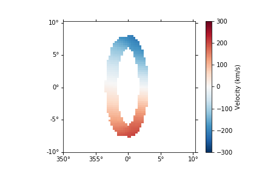

Custom Position-Position-Velocity Cubes
=======================================

While `modspectra` was initially created to create HI and H-Alpha models
specific towards Krishnarao, Benjamin, & Haffner (2019), the underlying
methods can be used to create custom PPV cubes using `~modspectra.cube.EllipticalLBV`

Though the name implies an elliptical geometry, in reality, any geometry 
and density distribution can be used. The underlying code relies on on 
`astropy.coordinates.GalacticLSR` coordinate frame object to supply coordinate
and velocity information and a density grid to be provided. 

We can custom create these and input them into `~modspectra.cube.EllipticalLBV`. 
Start by creating a regularly spaced grid in PPV space in Galactic Coordinates::

    >>> # Import statements
    >>> import numpy as np

    >>> # Set resolution: increase for better visuals and improved accuracy but slower
    >>> # compute times
    >>> nx,ny,nz = (64,64,64)

    >>> # Set Data Ranges
    >>> L_range = [-10,10] # Degrees Galactic Longitude
    >>> B_range = [-10,10] # Degrees Galactic Latitude
    >>> D_range = [6,10] # kpc

    >>> # Make LBD_grid
    >>> lbd_grid = np.mgrid[L_range[0]:L_range[1]:nx*1j,
    >>>                     B_range[0]:B_range[1]:ny*1j,
    >>>                     D_range[0]:D_range[1]:nz*1j]

This grid can be flattened and made into an `astropy.coordinates.Galactic` object::

    >>> import astropy.coordinates as coord
    >>> import astropy.units as u

    >>> # Transform grid into a 3 x N array for Longitude, Latitude, Distance axes
    >>> lbd = lbd_grid.T.reshape(-1,3, order = "F").transpose()

    >>> # Initiate astropy coordinates.Galactic object
    >>> lbd_coords = coord.Galactic(l = lbd[0,:]*u.deg, b = lbd[1,:]*u.deg, distance = lbd[2,:]*u.kpc)

These coordinates can now be transformed to different frames, such as 
`coord.Galactocentric` or :class:`~modspectra.cube.TiltedDisk`. In particular, the `~modspectra.cube.TiltedDisk` frame can be used to generically tilt any object along three axes. 

As an example, we can make a circular polar ring that is tilted 90 degrees off 
the plane of the Galaxy, and an inclination of 70 degrees::

    >>> from modspectra.cube import TiltedDisk

    >>> # Set Tilt Angles
    >>> alpha = 90 * u.deg # Tilt Angle
    >>> beta = 20 * u.deg # 90 - inclination
    >>> theta = 0 * u.deg 

    >>> # Transform to GalactoCentric Coordinates first to set galcen_distance
    >>> galcen_distance = 8.127 * u.kpc
    >>> galcen_coords = lbd_coords.transform_to(coord.Galactocentric(galcen_distance = galcen_distance))

    >>> # Transform to Tilted Disk
    >>> tilted_coords = galcen_coords.transform_to(TiltedDisk(alpha = alpha, beta = beta, theta = theta))

These coordinates can now be used to define a density grid::

    >>> # Reshape coordinates into grid shape
    >>> # First make array of xyz coordinates in TiltedDisk Frame
    >>> tilted_xyz_coords_arr = np.array([tilted_coords.x.value, tilted_coords.y.value, tilted_coords.z.value])
    >>> # Reshape into grid
    >>> tilted_xyz_grid = tilted_xyz_coords_arr.T.transpose().reshape(-1, nx, ny, nz)

    >>> # Create a Density Grid
    >>> density_grid = np.zeros_like(tilted_xyz_grid[0,:,:,:])

    >>> # Define a constant density 
    >>> density_value = 0.5 # cm^-3
    >>> # compute radial coordinate
    >>> tilted_r_coord = np.sqrt(tilted_xyz_grid[0,:,:,:]**2 + tilted_xyz_grid[1,:,:,:]**2)

    >>> # Set ring size masks for a ring between 0.9 kpc < r < 1.1 kpc
    >>> ring_mask = (tilted_r_coord > 0.9) & (tilted_r_coord < 1.1)
    >>> # Set thickness of ring as another mask in z
    >>> ring_mask &= np.abs(tilted_xyz_grid[2,:,:,:]) < 0.1 # kpc

    >>> # Define the density field
    >>> density_grid[ring_mask] = density_value

Lastly, we can assign velocities to each coordinate. In this example, 
a constant angular velocity is used::

    >>> # Define angular velocity by setting tangential velocity at 1 kpc
    >>> v_tan_1 = 200 * u.km/u.s
    >>> omega = v_tan_1 / (1. * u.kpc)

    >>> # Define Tangential Velocity Field
    >>> v_tan_grid = omega * tilted_r_coord*u.kpc
    >>> v_tan_grid = v_tan_grid.to(u.km/u.s)

    >>> # Get Velocity Vectors
    >>> sin_theta = tilted_xyz_grid[1,:,:,:] / tilted_r_coord
    >>> cos_theta = tilted_xyz_grid[0,:,:,:] / tilted_r_coord

    >>> velocity_grid = np.zeros_like(tilted_xyz_grid)
    >>> velocity_grid[0,:,:,:] = v_tan_grid.value * sin_theta # v_x
    >>> velocity_grid[1,:,:,:] = v_tan_grid.value * cos_theta # v_y

    >>> # Flatten Velocity to match coordinates array
    >>> velocity_arr = velocity_grid.T.reshape(-1,3, order = "F").transpose() * u.km/ u.s

    >>> # Define TiltedDisk Coordinates with velocity
    >>> disk_coordinates = TiltedDisk(x = tilted_coords.x, y = tilted_coords.y, z = tilted_coords.z, 
        v_x = velocity_arr[0,:], v_y = velocity_arr[1,:], v_z = velocity_arr[2,:], 
        alpha = alpha, beta = beta, theta = theta)

    >>> # Transform back to GalactoCentric with distance defined and then GalacticLSR
    >>> galcen_coords_withvel = disk_coordinates.transform_to(coord.Galactocentric(
                galcen_distance = galcen_distance))

    >>> lbd_coords_withvel = galcen_coords_withvel.transform_to(coord.GalacticLSR())

`~modspectra.cube.EllipticalLBV` can now be used to compute a PPV cube. It requires some
specialized arguments in the following order:

* lbd_coords_withvel: the coordinates we computed in Galactic Coordinates with Velocity Information
* density_gridin: The density grid we computed, but in order of Distance-Latitude-Longitude
* cdelt: step sizes for Longitude, Latitude, and Distance for the grid
* vel_disp: A gas velocity dispersion
* vmin/vmax: min / max velocity to compute velocity grid for
* vel_resolution: resolution of the velocity axis
* L_range: longitude range used
* B_range: latitude range used

The species keyword can be set to either 'hi' or 'ha' for HI or H-Alpha Emission. 
if using, speces = 'ha', you can also set redden = True to redden the emission values
using the Marshall et al. (2006) 3D dustmaps. For this example, we will do an HI cube::

    >>> # Flip density grid order
    >>> density_gridin = np.swapaxes(density_grid, 0,2)

    >>> Compute cdelt values
    >>> dD = lbd_grid[2,0,0,1] - lbd_grid[2,0,0,0]
    >>> dB = lbd_grid[1,0,1,1] - lbd_grid[1,0,0,0]
    >>> dL = lbd_grid[0,1,0,0] - lbd_grid[0,0,0,0]
    >>> cdelt = np.array([dL, dB, dD])

    >>> # Set other parameters / args
    >>> vel_disp = 9*u.km/u.s
    >>> vmin = -300 * u.km/u.s
    >>> vmax = 300 * u.km/u.s
    >>> vel_resolution = 550

    >>> # Run EllipticalLBV
    >>> from modspectra.cube import EllipticalLBV
    >>> data, wcs = EllipticalLBV(lbd_coords_withvel, density_gridin, cdelt, 
                                vel_disp, vmin, vmax, vel_resolution, 
                                L_range, B_range, species = 'hi')

This can now be loaded as an :class:`~modspectra.cube.EmissionCube` to introduce the 
rest of the spectral-cube pacakge tools and custom methods from this package::

    >>> from modspectra.cube import EmissionCube
    >>> cube = EmissionCube(data = data, wcs = wcs)

    >>> cube_moment_map = cube.moment(order = 1).to(u.km/u.s)

    >>> import matplotlib.pyplot as plt

    >>> fig = plt.figure()
    >>> ax = fig.add_subplot(projection = cube_moment_map.wcs)

    >>> im = ax.imshow(cube_moment_map.data, vmin = -300, vmax = 300, cmap = 'RdBu_r')
    >>> plt.colorbar(im)

