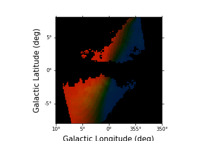

Plotting Moment Maps
====================

You can use the mechanisms from :class:`spectral-cube.SpectralCube` to create moment
maps from the modeled emission cubes. `astropy` and `matplotlib` allow for easy 
plotting of these images. 

An example is to make a three color image of the Tilted Ionized gas disk of 
Krishnarao, Benjamin, & Haffner (2019) with red for gas with a positive mean 
velocity, blue for gs with a negative mean velocity, and green for the 
integrated intensity.

We start with computing the H-Alpha Emission Data Cube::

    # Import EmissionCube
    from modspectra.cube import EmissionCube

    # Use default parameters 
    ha_cube = EmissionCube.create_DK19()

    ha_cube
    EmissionCube with shape=(550, 128, 128) and unit=R s / km:
     n_x:    128  type_x: GLON-CAR  unit_x: deg    range:     0.000000 deg:  359.842520 deg
     n_y:    128  type_y: GLAT-CAR  unit_y: deg    range:    -7.937008 deg:    8.062992 deg
     n_s:    550  type_s: VRAD      unit_s: m / s  range:  -324408.015 m / s:  325591.985 m / s

Moments can be computed using `spectral-cube.SpectralCube.moment()`::

    import astropy.units as u
    # Integrated H-Alpha surface brightness in Rayleighs
    integrated_ha = ha_cube.moment(order = 0).to(u.R)

    # Intensity weigted mean velocity in km/s
    velocity_ha = ha_cube.moment(order = 1).to(u.km/u.s)

We can construct our image array using this information and rescaling as we see fit::

    import numpy as np

    # Create RGB image array
    image = np.zeros((integrated_ha.shape[0], integrated_ha.shape[1] ,3))

    # Set Velocity Scaling:
    v_neg_max = -100. * u.km/u.s
    v_pos_max = 100. * u.km/u.s

    velocity_ha[velocity_ha > v_pos_max] = v_pos_max
    velocity_ha[velocity_ha < v_neg_max] = v_neg_max

    # min/max values for colors
    min_col = 0.25
    max_col = 0.75

    # Define Scaling Function
    def rescale(low, high, data):
        return low + (high - low) * (data) / (np.nanmax(data))

    # Set scaled color intensities for velocity
    scaled_velocity = rescale(min_col, max_col, velocity_ha.value)

    # Set Integrated Surface Brightness Range
    int_min = 0.1 * u.R
    int_max = 5. * u.R

    integrated_ha[integrated_ha < int_min] = 0.
    integrated_ha[integrated_ha > int_max] = int_max

    # Define Scaling Function
    def rescale_ha(low, high, data):
        return low + (high - low) * (data - np.nanmin(data)) / (np.nanmax(data) - np.nanmin(data))

    # Set scaled color intensities for Surface Brightness
    scaled_ha = rescale(0.1, 0.25, integrated_ha.value)

    # only color places with detectable integrated surface brightness
    scaled_ha[integrated_ha < int_min] = 0.
    scaled_velocity[integrated_ha < int_min] = 0.

    # Set G channel
    image[:,:,1] = scaled_ha

    # Set R and B channels
    image[:,:,0] = scaled_velocity
    image[:,:,2] = -1. * scaled_velocity
    # Remove negative values
    image[image<0.] = 0.

Use `astropy` and `matplotlib` with WCS axes to plot::

    import matplotlib.pyplot as plt

    fig = plt.figure()
    ax = fig.add_subplot(111, projection = integrated_ha.wcs)

    im = ax.imshow(image)

    ax.invert_xaxis()
    ax.set_xlabel("Galactic Longitude (deg)", fontsize = 15)
    ax.set_ylabel("Galactic Latitude (deg)", fontsize = 15)

